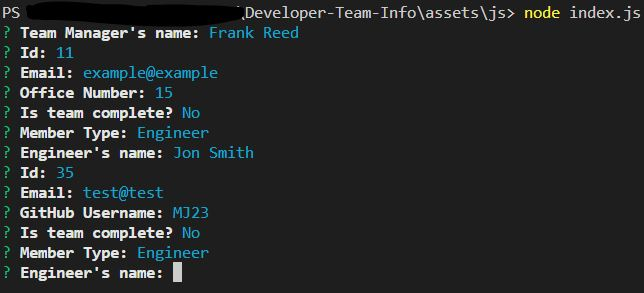
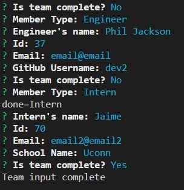
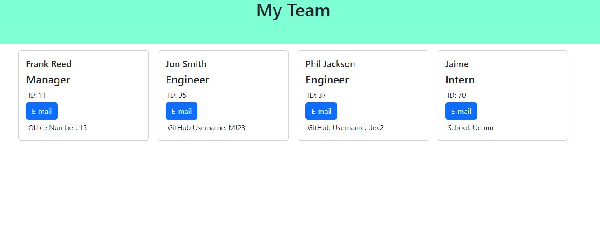

# Developer-Team-Info 2/9/2023

## Description

This project is an application that generates an HTML page of a development team based on user input to certain questions.

## Table of Contents

[Badges](#badges)

[Visuals](#visuals)

[Installation](#installation)

[Usage](#usage)

[Support](#support)

[Contribution](#contribution)

[Authors](#authors)

[License](#license)

<a name="badges"/>

## Badges

N/A

<a name="visuals"/>

## Visuals

<a name="installation"/>

## Installation

This project can be cloned from my GitHub repo link found at the bottom of this project's README file. Once installed node, package.json files, and inquirer are required to be installed to be able to run this.

Once cloned a command of node install can be run in the terminal to install the necessary dependencies of this project.

<a name="usage"/>

## Usage

This project could be used to produce a basic but quality HTML page for an existing project that includes the developer team's information.

<a name="support"/>

## Support

N/A

<a name="contribution"/>

## Contributing

The GitHub Repository can be found on the following this link [here.](https://github.com/aguilarj5/Developer-Team-Info.git)

<a name="authors"/>

## Authors and acknowledgment

GitHub: aguilarj5
Inquirer Documentation link: https://www.npmjs.com/package/inquirer

<a name="license"/>

## License

N/A
